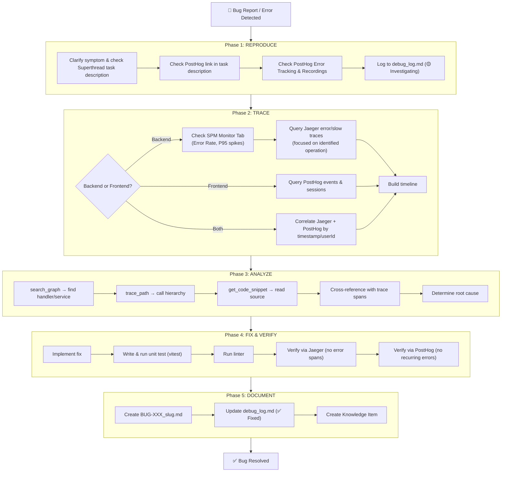

# Debug Workflow Guide

> Standardized debug workflow documentation for the SSL project.
> This workflow integrates OpenTelemetry/Jaeger tracing, PostHog analytics, and codebase-memory-mcp.

---

## Workflow Overview



---

## Quick Reference: Jaeger

### Prerequisites

```bash
# Check & start Jaeger
bash daniel_workspace/local_tracing/scripts/check_jaeger.sh

# Start backend with tracing
cd ssl-be
NODE_OPTIONS="--import ../daniel_workspace/local_tracing/instrumentation.mjs" pnpm start:dev
```

### Quick Look: SPM Monitor Tab (Backend — First Step)

1. Open [http://localhost:16686/monitor](http://localhost:16686/monitor)
2. Select service `ssl-be-local`
3. Find operations with a **High Error Rate** or **P95 latency spike**
4. Use that operation name to query specific traces in the next step

Or query Prometheus directly:
```bash
# Top operations with highest error rate
curl -s "http://localhost:9090/api/v1/query?query=topk(5,sum(rate(calls_total{service_name='ssl-be-local',status_code='STATUS_CODE_ERROR'}[1h]))by(operation))" | jq '.data.result[] | {op:.metric.operation, rate:.value[1]}'

# P95 latency (ms) by operation
curl -s "http://localhost:9090/api/v1/query?query=histogram_quantile(0.95,sum(rate(duration_milliseconds_bucket{service_name='ssl-be-local'}[5m]))by(le,operation))" | jq '.data.result[] | {op:.metric.operation, p95_ms:.value[1]}'
```

### Query Recipes: Detailed Traces

```bash
# Health summary
bash daniel_workspace/local_tracing/scripts/query_traces.sh --summary

# Error traces (last 30 minutes)
bash daniel_workspace/local_tracing/scripts/query_traces.sh --errors --last 30

# Slow traces (>2 seconds)
bash daniel_workspace/local_tracing/scripts/query_traces.sh --slow 2000

# Specific operation
bash daniel_workspace/local_tracing/scripts/query_traces.sh --op "POST /api/v1/invitations"

# List all services
bash daniel_workspace/local_tracing/scripts/query_traces.sh --services
```

### Raw curl Examples

```bash
# All error traces
curl -s "http://localhost:16686/api/traces?service=ssl-be-local&tags=%7B%22error%22%3A%22true%22%7D&limit=20&lookback=1h" | jq

# Traces for specific operation
curl -s "http://localhost:16686/api/traces?service=ssl-be-local&operation=GET%20/api/v1/users&limit=5" | jq

# Specific trace by ID
curl -s "http://localhost:16686/api/traces/{traceId}" | jq
```

### Jaeger UI

- **Search Traces:** [http://localhost:16686](http://localhost:16686) — select service `ssl-be-local`
- **Monitor Tab (SPM):** [http://localhost:16686/monitor](http://localhost:16686/monitor) — Aggregated RED metrics
- **Filters:** Use tags (`error=true`, `http.status_code=500`) for filtering
- **Prometheus UI:** [http://localhost:9090](http://localhost:9090) — custom PromQL queries

---

## Quick Reference: PostHog

### Mandatory Superthread Task PostHog Link Inspection

Whenever a bug is linked to a Superthread task:
1. Fetch task details via Superthread MCP (`task_get` or `getTask`).
2. Check the task description for any PostHog links (session recordings, error tracking issues, or event replays).
3. Whenever a PostHog link is present, use PostHog MCP (`posthog:exec`) to investigate the linked session recording and logs as part of root cause analysis.
4. **This step is mandatory and must not be skipped.**

### Error Tracking

```text
# Step 1: Search for error tracking tools
posthog:exec → search error-tracking

# Step 2: Get tool schema
posthog:exec → info query-error-tracking-issues-list

# Step 3: Query errors
posthog:exec → call query-error-tracking-issues-list { dateRange, filters }

# Step 4: Get specific error details
posthog:exec → call query-error-tracking-issue-events { issueId }
```

### Session Recordings

```text
# Step 1: Get tool schema
posthog:exec → info query-session-recordings-list

# Step 2: Query recordings by person email
posthog:exec → call query-session-recordings-list {
  "person_uuid": "...",
  "date_from": "-7d"
}

# Step 3: Or search by event
posthog:exec → call query-session-recordings-list {
  "events": [{ "id": "$pageview", "name": "$pageview" }]
}
```

### Event Analysis

```text
# Step 1: Discover available events
posthog:exec → call read-data-schema { "query": { "kind": "events" } }

# Step 2: Query trends for error frequency
posthog:exec → info query-trends
posthog:exec → schema query-trends series
posthog:exec → call query-trends { series, dateRange, interval }
```

### Useful Queries

| Scenario | Tool | Key Filters |
|---|---|---|
| Find JS exceptions | `query-error-tracking-issues-list` | dateRange, status |
| User journey replay | `query-session-recordings-list` | person email, date range |
| Error frequency over time | `query-trends` | error event, daily interval |
| Affected user count | `query-trends` | unique users math, error event |
| Conversion impact | `query-funnel` | signup → error → recovery steps |

---

## Real-World Examples

### Example 1: BUG-003 — Admin Permission Denied

**Phase 2 (TRACE):**
- Jaeger showed a `403 Forbidden` response from `POST /api/v1/groups/{id}/invitations`
- MongoDB query span showed `findOne` on `participants` collection returning a **soft-deleted** record

**Phase 3 (ANALYZE):**
- `search_graph(name_pattern=".*GroupParticipant.*")` found the controller
- `trace_path` revealed `findOne` wasn't filtering `isDel: false`
- Root cause: `mongooseCtr.findOne` returns first matching doc including deleted records

### Example 2: BUG-006 — ChunkLoadError Redirect

**Phase 2 (TRACE):**
- PostHog session recording showed user clicking notification → blank page → "Something went wrong"
- PostHog error tracking captured `ChunkLoadError: Failed to load chunk /_next/static/chunks/...`

**Phase 3 (ANALYZE):**
- `search_graph(name_pattern=".*ChunkErrorHandler.*")` found the error handler
- Handler pattern array was missing `"Failed to load chunk"` variant
- Root cause: Only matched `"Loading chunk"` but Next.js uses different wording

---

## Correlation: Jaeger ↔ PostHog

When a bug spans both backend and frontend:

1. **Get the timestamp** from PostHog error event
2. **Query Jaeger** with that timestamp range:
   ```bash
   curl -s "http://localhost:16686/api/traces?service=ssl-be-local&start={epoch_us}&end={epoch_us + 60s}&limit=10" | jq
   ```
3. **Match by userId** — Check Jaeger span tags for `user.id` and PostHog person `distinct_id`
4. **Build combined timeline:**
   ```
   [PostHog] 14:30:01 - User clicked "Invite" button
   [Jaeger]  14:30:01 - POST /api/v1/groups/123/invitations (start)
   [Jaeger]  14:30:01 - mongodb.findOne participants (800ms)
   [Jaeger]  14:30:02 - 403 Forbidden returned
   [PostHog] 14:30:02 - Error toast displayed
   [PostHog] 14:30:05 - User navigated away
   ```

---

## File Structure

```
daniel_workspace/
├── debug_log.md                            # Running error journal
├── bug_cases/
│   ├── _TEMPLATE.md                        # Template (with Tracing & PostHog sections)
│   └── BUG-XXX_slug.md                     # Individual bug case files
├── local_tracing/
│   ├── instrumentation.mjs                 # OpenTelemetry auto-instrumentation
│   ├── package.json                        # OTel dependencies
│   ├── docker-compose.yml                  # Jaeger v2 + Prometheus (SPM)
│   ├── jaeger-config.yaml                  # Jaeger v2 OTel Collector config (spanmetrics)
│   ├── prometheus.yml                      # Prometheus scrape config
│   └── scripts/
│       ├── check_jaeger.sh                 # Check & auto-start (docker compose up -d)
│       └── query_traces.sh                 # Quick trace query shortcuts
├── docs/
│   ├── tracing_guide.md                    # Jaeger v2 + SPM setup guide
│   └── debug_workflow_guide.md             # This file
├── .agents/
│   └── skills/
│       └── debug-workflow/
│           └── SKILL.md                    # Debug workflow skill definition
```
